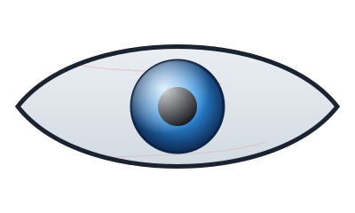

<h3>你在看我，我也在看你</h3>

---

## lnbo

**一个人 + 一排 AI Agent，就是一支军队。**

白天指挥 Agent 写代码、打包、发布；晚上它们替我盯服务器。
从拼多多仓储系统到多语言 IDE，从 MCP 工具链到 Electron 三端分发——
想法到成品，往往只隔一个 prompt。

### 火力覆盖

| 战区 | 武器 |
| --- | --- |
| [Table Recon](https://github.com/monikalnbo/table-recon) | 双表核对引擎：核心 CLI + Web GUI + MCP + Electron 三端 + iOS 壳，一套代码全平台 |
| [ERP Warehouse](https://github.com/monikalnbo/erp-warehouse-py) | 拼多多 API 对接 · 重量公式引擎 · 电子面单 · 快递对账 |
| [FruitERP](https://github.com/monikalnbo/fruiterp) | 水果电商管控：插件化 Node 架构，卖出/待发/已发三板块 |
| [CodeForge](https://github.com/monikalnbo/lnbocharm) | 多语言桌面 IDE：C/C++/C#/Rust/Python/Java，LSP + 断点调试 |
| [Hermes Studio](https://github.com/monikalnbo/hermes-studio) | Agent 指挥台：多平台对话 · 定时任务 · 用量分析 |
| [JM Search](https://github.com/monikalnbo/jm-search) | Flask 搜索站：搜索 · 详情 · 在线阅读 · 多用户点赞 |

### 弹药库

### 战报

  
  

  
  

### 蛇行轨迹

<picture>
  <source media="(prefers-color-scheme: dark)" srcset="https://raw.githubusercontent.com/monikalnbo/monikalnbo/output/github-contribution-grid-snake-dark.svg" />
  
</picture>
